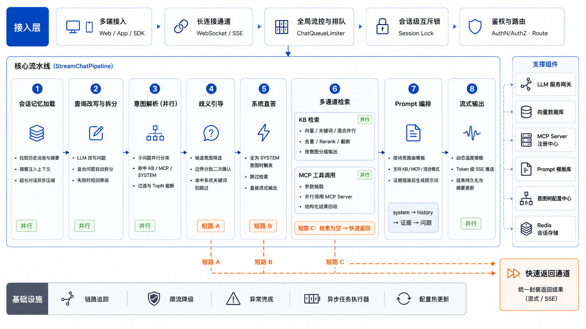

## 什么是 Ragent AI？

Ragent 是一个企业级 Agentic RAG 平台，覆盖从文档入库到智能问答的完整链路。

- **多路检索**：多渠道并行检索，去重重排兼顾精准与召回。
- **意图识别**：树形多级分类，置信度不足主动引导澄清，扩展模型、提示词、topK 等核心参数。
- **模型引擎**：模型调度、首包探测、健康检查、自动降级，模型故障不影响服务。
- **MCP 集成**：非知识类意图自动提参调用业务工具，检索与工具无缝融合。
- ……

生产落地智能体会踩的坑，这里都有对应方案，一套经过真实场景锤炼的工程实践，系统补全 RAG / Agent / MCP 等知识，面试写进简历聊得起来。

## Ragent 核心设计

采用前后端分离的架构模式，后端按职责分为四个 Maven 模块。

一次用户提问，在 Ragent AI 服务里经过的核心链路如下所示：

### 多路检索 + 后处理流水线

检索是 RAG 系统的核心，Ragent 的检索引擎采用多通道并行 + 后处理流水线的架构：

每个通道独立执行、互不影响，通过线程池并行调度。后处理器按顺序串联，像流水线一样逐步精炼检索结果。

### 多模型路由与故障转移

生产环境不可能只依赖一个模型供应商，Ragent 的模型路由机制解决的就是这个问题：

关键设计：三态熔断器，用于保护系统不会持续调用已经故障的模型。

## Fork 增强特性

本仓库基于 [nageoffer/ragent](https://github.com/nageoffer/ragent) 进行了多项工程增强，以下是新增的主要特性。

### 1. 新增 BM25 关键词检索通道

**动机**：纯向量检索对精确关键词匹配较弱（如订单号、专有名词），混合检索是 RAG 系统的标配。

**实现**：新增 `KeywordSearchChannel`，基于 PostgreSQL 的 `tsvector` + GIN 索引实现 BM25 全文检索。同时实现 `RrfFusionPostProcessor`，使用 Reciprocal Rank Fusion 算法将向量检索和关键词检索的结果融合重排。`zhparser` 中文分词插件支持中文语义切分。

**意义**：检索召回率显著提升，特别是在用户查询包含明确关键词的场景下。多通道结果通过 RRF 融合，兼顾语义相似度和关键词精确度。

### 2. 重构结构感知分块策略

**动机**：upstream 的 `StructureAwareTextChunker` 采用基于下标的 Block 打包模型，只按空行分段后在块边界贪心合并，无法感知标题层级关系——同级标题下的多个小段落可能被拆散，不同标题下内容又可能被错误合并。参照 LangChain `ExperimentalMarkdownSyntaxTextSplitter` 的逐行扫描 + header-stack 思路进行重构。

**实现**：核心改动是将 Block 模型替换为 header-stack 多阶段流水线：
- **Phase 1**：逐行扫描，维护 `Deque<HeaderEntry>` 标题层级栈，每个 Section 携带当前标题路径快照（而非仅记录起止下标）
- **Phase 2**：结构感知合并——标题作为结构边界强制切断，水平线 `---` 作为硬边界，合并时取首个 Section 的标题路径
- **Phase 3**：构建 VectorChunk 时将标题路径格式化为 `[H2 > H3]` 前缀拼入 content，仅对同一递归切分组内的相邻 chunk 添加 overlap

**意义**：分块结果严格遵循 Markdown 标题层级，同一节下的内容不会被拆散，不同节的内容不会被错误合并。标题路径信息同时写入 content 前缀和 metadata，下游检索和 LLM 都能利用结构信息。

### 3. 新增父子分块策略以及对应后处理器

**动机**：父子分块策略中，检索命中的通常是粒度较小的子分块，但回答需要更大的上下文窗口。

**实现**：`ParentChildUpliftPostProcessor` 在后处理链中自动检测命中的子分块，向上查找父分块并替换内容，同时保留子分块的检索得分用于排序。

**意义**：在保持细粒度检索精度的同时，为 LLM 提供更完整的上下文信息，提升回答质量。

### 4. 新增 SSE Context 事件（用于参考来源展示）

**动机**：用户需要了解回答引用了哪些文档片段，增强可信度和可解释性。

**实现**：后端在流式回答过程中，通过新增的 `CONTEXT` SSE 事件类型将检索到的 chunks 实时推送至前端。`t_message` 表新增 `contexts` 字段持久化引用信息。前端 `MessageItem` 组件展示可折叠的"参考来源"面板。

**意义**：实现检索结果的可追溯性，用户可直观验证回答依据，提升系统透明度和信任度。

### 5. 多模态文档嵌入与参考来源图片展示

**动机**：原系统仅处理文本，PDF/PPT 中的图表、截图等图片信息在解析阶段被丢弃，用户无法通过自然语言查询图表中的数据；同时第 4 节的参考来源面板只能展示纯文本，命中的图片无法直观呈现。

**实现**：打通「图片进得来、出得去」的完整链路，分摄取与推送两段。

**摄取侧（图片 → 描述 → 入库）**：
- 视觉模型独立服务层：参照 embedding/rerank 模式新增 `VisionClient` → `RoutingVisionService` → `ai.vision` ModelGroup 路由链，三态熔断 + 自动降级，提供 Bailian/Ollama/SiliconFlow/AIHubMix 四个 Provider，不侵入现有 ChatMessage/ChatClient
- Tika 图片提取：自定义 `EmbeddedDocumentExtractor` 收集 PDF 内嵌图片，按大小、数量、hash 三重过滤去重
- Pipeline 新增 `ImageDescriptionNode`：读取提取的图片 → 上传 RustFS → VLM 以 base64 data URI 生成描述 → 构造 `contentType=IMAGE` 的 VectorChunk → 复用现有文本 Embedding 入库
- 统一数据模型：`VectorChunk`/`RetrievedChunk`/`KnowledgeChunkDO` 增加 `contentType`/`imageUrl`/`imageMimeType`，`t_knowledge_chunk` 表新增对应列（`upgrade_v1.3_to_v1.4.sql`）；`PgRetrieverService` 向量检索 JOIN chunk 表回带图片字段，BM25 全文检索同步补充

**检索推送侧（结构化 context + 图片代理）**：
- 在第 4 节的 SSE `context` 事件基础上，将载荷由 `string[]` 升级为结构化 `RetrievedContextItem`（id/text/contentType/imageUrl/score），命中 IMAGE chunk 时附带图片代理 URL，前端按命中顺序与文本交错渲染
- 新增 `GET /knowledge-base/chunks/{chunkId}/image` 图片代理端点：凭 chunk id 回库取对象存储地址再 `openStream`，**不向前端外泄 s3:// 内部地址**；业务逻辑下沉 service，路径常量集中到 `ChunkImageEndpoint` 枚举
- 持久化 contexts 同步升级为结构化（同列 JSON，零 schema 改动），`parseContexts` 兼容历史 `string[]` 数据回退为 TEXT 条目
- 修复 `ForwardingStreamCallback` 未转发 `onContext` 的 bug：trace 装饰路径下参考来源事件此前被静默吞掉

**意义**：文档中的图表、表格、截图等视觉信息不再丢失，RAG 覆盖文档全量语义；命中图片时参考来源面板直接展示缩略图 + 描述，从纯文本进化为图文交错。视觉模型独立路由，故障不影响 Chat/Embedding 等其他链路。

## 未来计划

### 重构 Metadata 体系

**动机**：当前 chunk 只有一个扁平的 `Map<String, Object> metadata`，各种字段混在一起，并且检索时被没有有效利用到元数据去进行权限校验、知识有效期限制、基于 LLM 的从用户问题(针对每一个子问题)的动态过滤条件抽取。

**规划**：将 metadata 拆分为 **sys_metadata（系统元数据）** 和 **biz_metadata（业务元数据）**

- **sys_metadata（系统元数据）**：不经 LLM 生成过滤条件,直接拼接 SQL
- **biz_metadata（业务元数据）**：可有 LLM 基于用户问题动态生成过滤条件

**预期收益**：系统管控与业务语义解耦，sys_metadata 保证安全合规（权限、过期），biz_metadata 提升检索精度（结构化过滤）。admin 可按业务场景动态配置 schema。

## 贡献

Ragent AI 仍在持续迭代中，欢迎参与共建，一起把项目打磨得更好。 感谢各位亦菲、彦祖们对 Ragent AI 的贡献：

    

